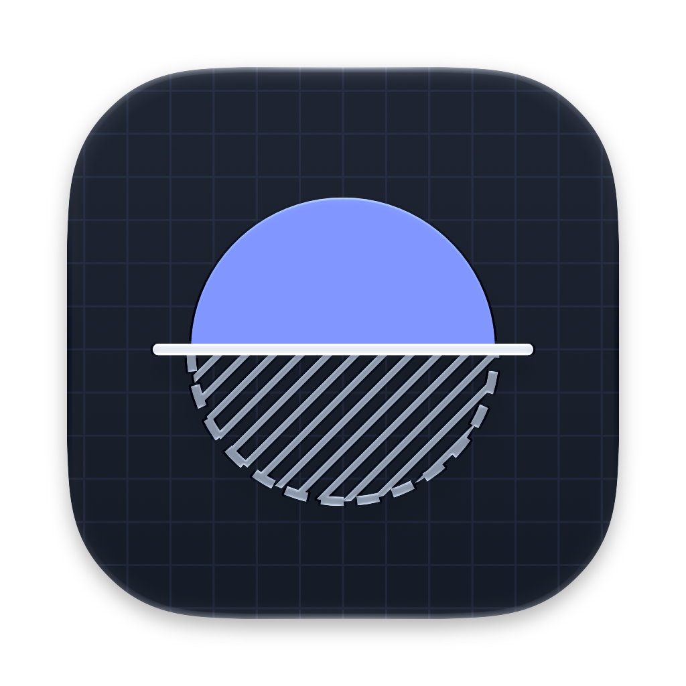

<p align="center">
  
</p>

<h1 align="center">Solyx</h1>

A personal desktop app for trading Taiwan and US stocks. An agent analyzes the market and proposes trades; nothing is sent to a broker until you confirm it yourself.

> Only the skeleton exists so far: a paper account, pre-trade risk checks, and the propose-and-confirm order flow. Market data, the agent and live brokers are not wired up yet.

## Principles

- **Local-first:** broker certificates, credentials and API keys stay on your machine. There is no relay server.
- **Bring your own key:** market data providers and LLMs run on your own accounts and keys.
- **A human confirms every order:** the agent can only propose. Risk checks run again right before an order goes to the broker.
- **Paper by default:** live trading stays off until you explicitly turn it on.

## Development

Requires [Vite+](https://viteplus.dev/) (`vp`) and Node.js 22.18 or later.

```bash
vp install     # install dependencies
vp run dev     # start the desktop app in development mode
vp run ready   # check, test and build
```

Architecture and repository rules live in [`AGENTS.md`](./AGENTS.md).

## License

Copyright (C) 2026 Chia1104

Solyx is free software under the [GNU Affero General Public License, version 3 or later](./LICENSE). Vendored third-party code keeps its own license, such as the MIT-licensed anti-slop plugin in `tools/oxlint/anti-slop`.

## Disclaimer

This software is not investment advice. You alone are responsible for any gains or losses from trades made with it. It is provided as is, without warranty of any kind.
